# M-TUNE E-commerce Store


Welcome to [M-TUNE](https://m-tune-d4849222b5e5.herokuapp.com/), your one-stop online shop for musical instruments and accessories. Our platform offers a seamless shopping experience with a wide range of products, from guitars to drum sets, all available at the click of a button.

## Table of Contents

- [Introduction](#m-tune-e-commerce-store)
- [User Experience (UX)](#ux)
- [Design Choices](#design)
- [Features](#features)
  - [Existing Features](#existing-features)
  - [Future Features](#future-features)
- [Important Stripe Payment Information](#-important-payment-processing-with-stripe)
- [Agile Development](#agile-development)
- [Database Design](#database-design)
- [E-commerce Business Model](#e-commerce-business-model)
- [SEO & Social Media Marketing](#seo--social-media-marketing)
- [Testing](#testing)
- [Technologies Used](#technologies-used)
- [Deployment](#deployment)
  - [ElephantSQL Database](#elephantsql-database)
  - [Amazon AWS](#amazon-aws)
  - [Stripe API](#stripe-api)
  - [Gmail API](#gmail-api)
  - [Heroku Deployment](#heroku-deployment)
  - [Local Deployment](#local-deployment)
- [Credits](#credits)
  - [Docs](#docs)
  - [Content](#content)
  - [Acknowledgement](#acknowledgement)

---

## UX

Our philosophy in designing M-TUNE was rooted in simplicity and user-friendliness. We understand that a complex design can overwhelm and deter potential customers, which is why we've embraced a straightforward approach to our e-commerce platform. Our goal is to create an inviting environment that encourages users to explore and purchase musical instruments with ease.

Upon arrival, visitors are welcomed by a sleek and prominent image that encapsulates the spirit of music, accompanied by our tagline "Feel the rhythm, embrace the sound." This imagery, along with a clear call-to-action button, swiftly guides users to our product page. This streamlined entry point ensures that users have immediate access to our product range without unnecessary distractions.

Navigational simplicity is at the heart of M-TUNE. Users can effortlessly add items to their basket from product listings and detailed product pages. The shopping basket is a constant presence within the navigation menu, accessible from every page, reinforcing transparency and trust by displaying a running total. This feature aligns with our commitment to honesty and customer empowerment, avoiding any hidden costs that could surface during checkout.

Our intuitive main navigation menu is engineered for ease, allowing users to find and filter musical instruments and accessories by category with just a click. This ease of access is mirrored in the site's footer, where additional filtering options are available, enhancing discoverability and user autonomy.

In addition to these features, M-TUNE has a unique touch for music enthusiasts. Just as retro gamers have their Konami code, our users can find special interactive surprises that resonate with the musical community, fostering a deeper connection with our audience.

The M-TUNE experience is crafted to be seamless and engaging. With user-centric design, straightforward navigation, and a sprinkle of playful elements, we believe that our site not only meets the needs of our customers but also provides a delightful journey from the first note to the final purchase.

### Design

- **Color Scheme**: We've used a combination of white (#fff), light gray (#f4f4f4), red (#f00), deep purple (#62337F), and black (#000), chosen with the help of [coolors.co](https://coolors.co).
- **Typography**: Our fonts are Ubuntu for its readability and Days One for its modern appeal.
- **Logo**: Our logo uses the Phosphate font, embodying the essence of M-TUNE in a simple yet impactful way.

  

- **Design**: All design templates was made by myself in figma before starting the project itself and were updated while coding, so it might be change

  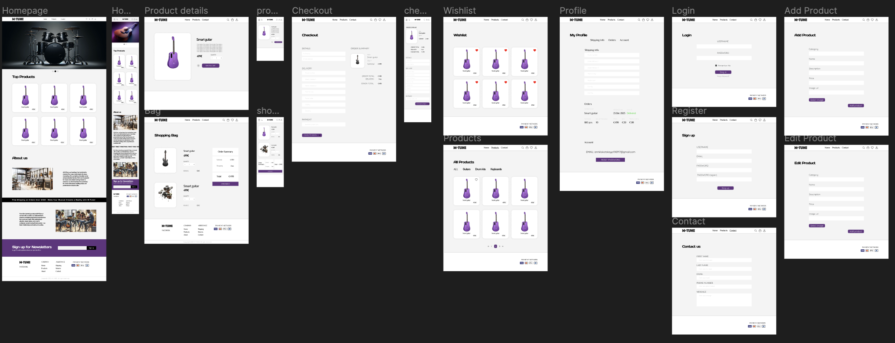

## Features

### Existing Features

#### Homepage

- A welcoming entrance with an inspiring image that captures the essence of music and sets the tone for the shopping experience.

- The homepage showcases top products selected by our team, providing a quick glance at our best offerings.

- An ‘About Us’ section that tells the story of M-TUNE, our passion for music, and our commitment to customers.

- A newsletter subscription form located in the footer, inviting users to stay in tune with the latest deals and updates from M-TUNE.

  

#### Product Discovery and Management

- **Product Pages**: Users can browse through our extensive catalog with ease using search functionality, category filters, and pagination to find their desired instruments.

  

- **Product Detail**: Each product has a dedicated page providing detailed descriptions, stock availability, and the option to add to the shopping bag or wishlist.

  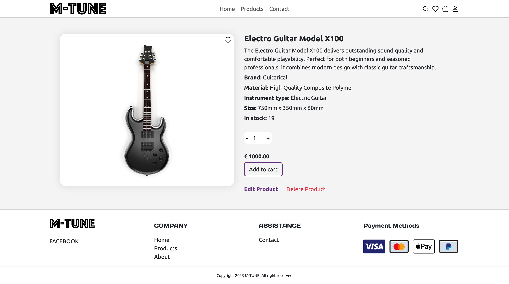

- **Wishlist**:  A personalized feature for logged-in users to save their favorite items for later consideration.

  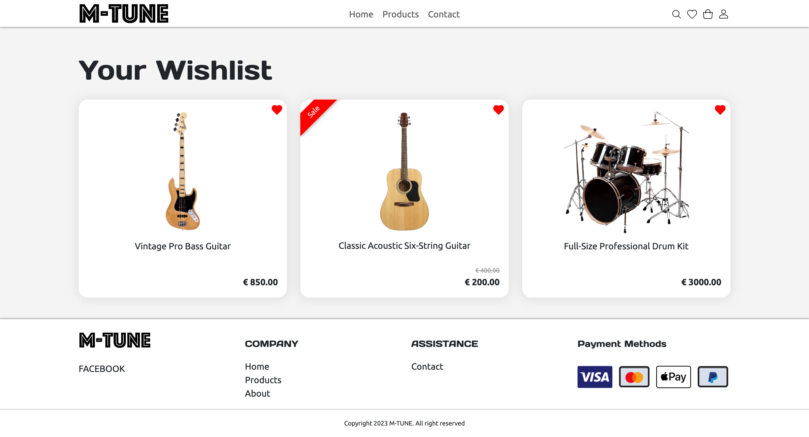

- **Admin Product Management**: As an admin, you can seamlessly manage the product inventory with Create, Read, Update, and Delete (CRUD) functionalities directly from the frontend.

  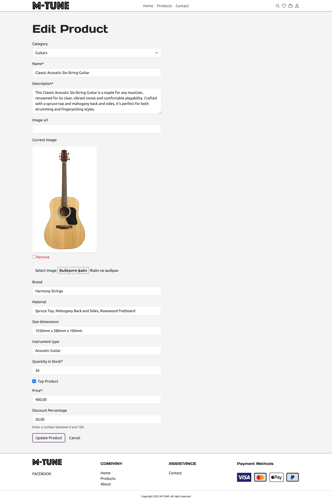

#### Shopping Experience

- **Shopping Bag**: An accessible and ever-present basket is embedded within the navigation menu, showing users a summary and the total cost of their selected items.

  

- **Checkout**: A streamlined checkout process integrated with Stripe ensures secure and hassle-free payments. Upon completion, customers receive a confirmation email, and stock levels are automatically updated.

  

#### User Account and Profile

- **Profile Page**: Registered users can view and manage their profile, reset passwords, and review their order history. Admins have additional privileges, including adding new products through a user-friendly interface.

  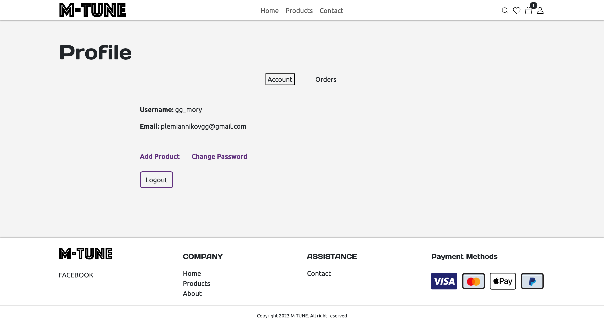

- **User Profile**: For order history and account management. Admins can add products through a front-end form.

  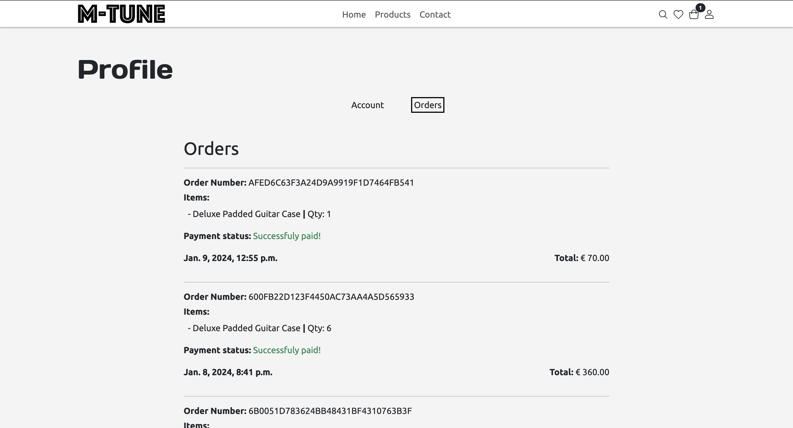

#### Contact Us

- **Focused Inquiry Page**: Our Contact Us page is specifically designed for customer inquiries, accessible through a direct link in the site's navigation. Here, customers can fill out a form to reach us regarding any questions, support needs, or feedback.
- **Confirmation Alerts**: After submitting the form, users receive a confirmation alert on the Contact Us page itself, assuring them that their message is important to us and will be addressed promptly.
- **Email Follow-Up**: In addition to the on-site confirmation, we send an automated response to the user's email, providing a copy of their inquiry and confirming that our customer service team will be in touch as soon as possible.

  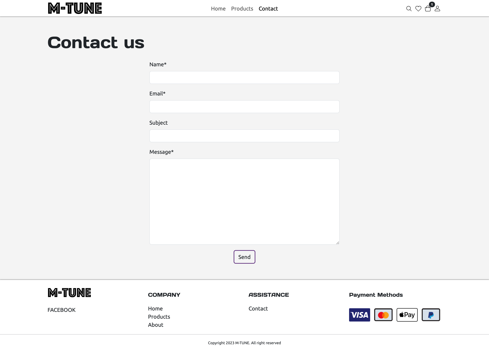

#### Enhanced Email Notifications

- **Checkout Confirmation**: After a successful purchase, customers receive a detailed email confirmation outlining their order, which serves as a receipt and a token of appreciation for their business.
- **Contact Confirmation**: Following the submission of the Contact Us form, an automatic email is dispatched to the customer, ensuring them their message has been received and a member of our team will be in contact shortly.
- **Registration Acknowledgement**: New users are welcomed to M-TUNE with a warm email after registration, providing them with a summary of their account details and encouraging them to explore our collection.
- **Password Reset Notifications**: In the event of a password change, users are promptly notified via email, ensuring them of the security of their account and confirming that their password has been successfully updated.
- **Newsletter Subscription**: Upon subscribing to our newsletter, users receive a confirmation email thanking them for their interest and possibly including a special welcome discount or offer as a token of our gratitude.

### Future Features

- **Reviews**: We plan to implement a review system where users can rate and review products.
- **Shipping Info**: A feature to save shipping information, making repeat purchases more convenient for our users.
- **Social Sign-On**: We aim to introduce social media account integration for easy sign-in and registration.
- **Payment Expansion**: We're looking to expand our payment options to include services like Apple Pay for a wider range of choices.
- **Newsletter Unsubscription**: Recognizing the importance of choice, we will be implementing an easy unsubscription feature. This will allow users to opt-out of receiving newsletters via a simple link in the email, ensuring that we respect their communication preferences and keep their inbox clutter-free.

---

## 🔥 Important: Payment Processing with Stripe

> **Note:** The following section is particularly crucial as it outlines the plans for a significant improvement in payment system's integrity and reliability.<br><br>
> **Important Context:** Due to an extremely tight deadline for this project, the enhancement of the payment processing system described below has been identified as a priority for the next development phase. The current implementation is functional, but I aim to refine this feature to align with best practices as I continue to improve my project.

Currently, M-TUNE utilizes Stripe for secure online payment processing. During the testing phase, it was observed that while Stripe handles invalid payment data robustly, the user interface does not always reflect the backend validation accurately. This means that, in some cases, the payment may appear to be successful on Stripe's end, but the user might receive an error due to invalid data entry on the checkout form.

### Current Implementation

The present system employs JavaScript to facilitate client-side confirmation of payments. While this method is in line with the practices taught in the Boutique Ado project, I've noted that it may not be entirely suitable for real-world scenarios where stringent validation and error handling are crucial.

### Planned Improvements

In light of this, the following steps are planned to enhance the payment process:

- **Backend Validation**: Transitioning from a client-side to a server-side validation model for payments. This aligns with Stripe’s recommendations and ensures that the payment process is only completed once all the form data has been validated by the backend, preventing any discrepancies.
- **Comprehensive Stripe Integration**: Dedicating time to delve deeper into Stripe’s extensive documentation to fully leverage its capabilities. The goal is to implement a more robust payment system that aligns with real-world e-commerce standards.
- **Continuous Testing**: Implementing rigorous testing for all possible checkout scenarios to ensure a seamless and error-free user experience.

### Acknowledgement 

I acknowledge that the current payment process, as per the Boutique Ado walkthrough, served as a solid foundation. However, for M-TUNE to thrive in a real-world environment, it is essential to adopt a more thorough approach. The commitment to revising our Stripe integration reflects our dedication to providing a secure, reliable, and user-friendly shopping experience.

---
## Agile Development

Employed Agile methodology to manage the project using Epics, User Stories, Iterations, and a Kanban board.


### Iterations Summaries

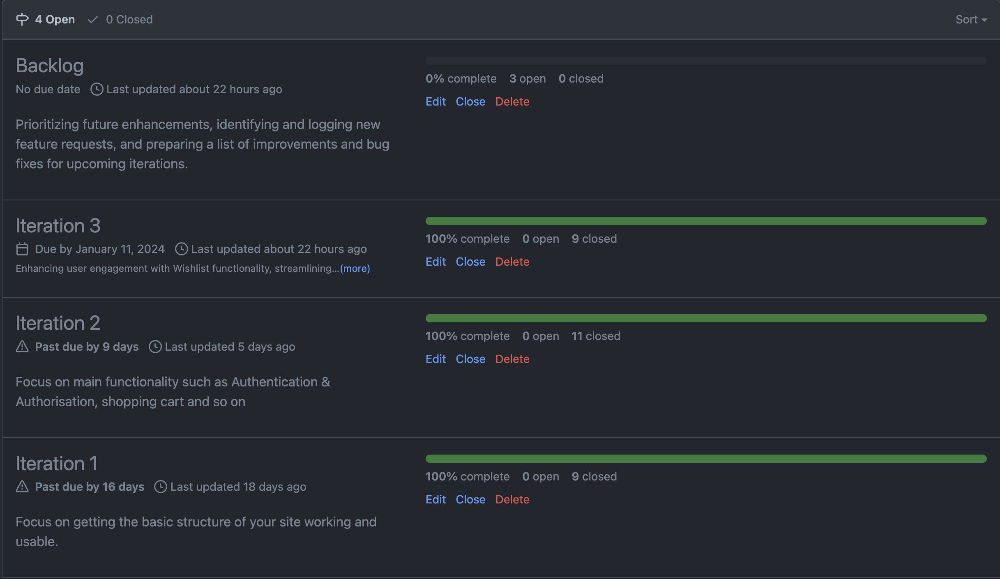

### User Stories

The development of M-TUNE has been guided by a series of user stories, grouped into epics to adopt an agile development approach. Each epic encompasses a set of related functionalities designed to enhance the user experience on our platform.

### EPIC Summaries

  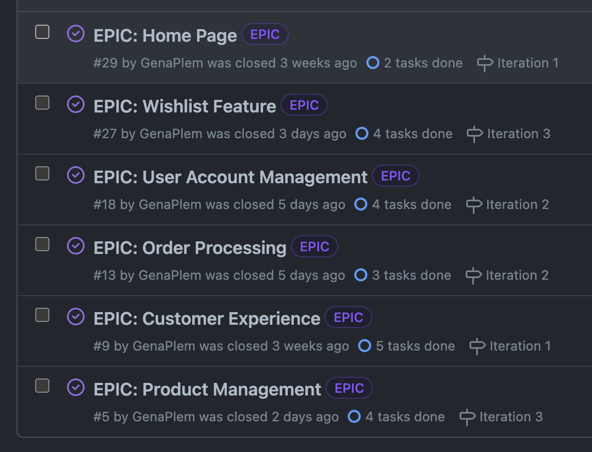

Below is an outline of the various epics that have been targeted in our development process:

**EPIC: Home Page**

This epic focused on ensuring the home page effectively communicates the purpose of M-TUNE and provides a welcoming entry point for users.

Tasks included:
  

**EPIC: Wishlist Feature**

Enhancements to the wishlist feature allow users to save items for future purchase, reflecting a personalized shopping experience.

Tasks included:
  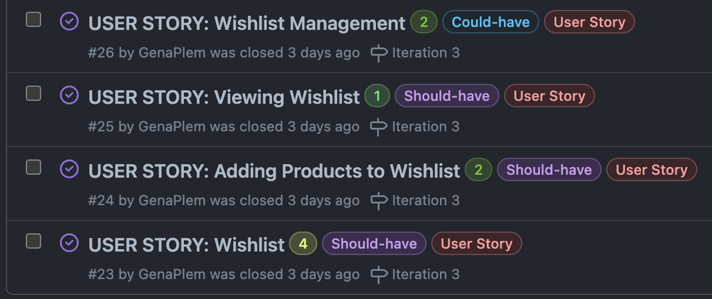

**EPIC: User Account Management**

Focusing on user accounts, this epic ensures users can manage their accounts with ease, from sign-up to viewing order history.

Tasks included:
  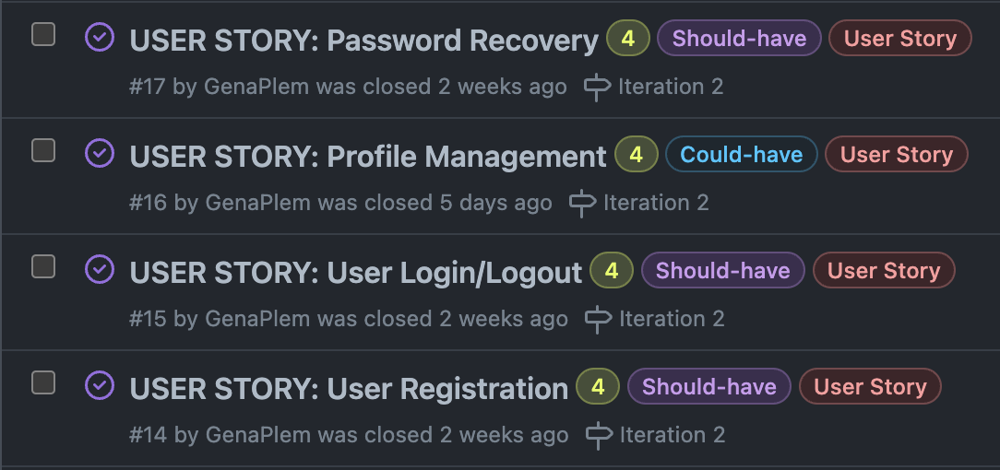

**EPIC: Order Processing**

Ensuring a smooth transition from shopping bag to successful order completion, with reliable checkout and payment systems.

Tasks included:
  

**EPIC: Customer Experience**

Dedicated to enhancing the overall customer experience on the site.

Tasks included:
  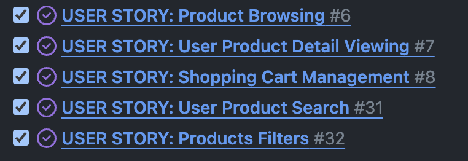

**EPIC: Product Management**

Providing admins with the tools to manage product listings efficiently, ensuring the product offerings are up-to-date.

Tasks included:
  

## Database Design

I created an entity relationship diagram using [Drawsql.app](https://drawsql.app/).


## E-commerce Business Model

M-TUNE operates on a straightforward Business to Customer (B2C) model, targeting individual customers with a diverse range of musical instruments and accessories. Our model is designed to facilitate individual transactions without the need for subscriptions, making it accessible and user-friendly.

### SEO & Social Media Marketing

#### Social Media Presence

- **Facebook Business Page**: We have established a presence on Facebook, a platform with a vast user base, to connect with our community, showcase our products, and drive traffic to our site. Our Facebook page serves as a platform for announcements, product highlights, and customer engagement.

  

#### Newsletter Engagement

- **Newsletter Sign-up**: Our website features a sign-up form for our newsletter, allowing visitors to stay updated with the latest offers, product arrivals, and news. Unique email addresses are collected to maintain an organized and spam-free communication channel.

```
class NewsletterSubscriber(models.Model):
    email = models.EmailField(unique=True)
    is_subscribed = models.BooleanField(default=True)
    date_subscribed = models.DateTimeField(auto_now_add=True)
    date_unsubscribed = models.DateTimeField(null=True, blank=True)

    def __str__(self):
        return self.email
```

#### Search Engine Optimization

- **Keywords**: We've identified a mix of short-tail and long-tail keywords that align with our products and brand, optimizing our site's visibility in search engine results.
- **Sitemap & Robots.txt**: To aid in search engine indexing, we have generated a sitemap.xml and configured a robots.txt file, ensuring search engines can crawl our site efficiently.

```
User-agent: *
Disallow: /accounts/
Disallow: /bag/
Sitemap: https://m-tune-d4849222b5e5.herokuapp.com/sitemap.xmlx
```

#### Future Marketing Strategies

- **Google Search Console**: Plans to utilize tools like Google Search Console for deeper insights into our site's search performance.
- **Enhanced Social Media Campaigns**: We aim to leverage social media platforms further by engaging with our community through regular updates, interactive posts, and promotional events.

## Testing

Comprehensive manual testing was conducted to ensure all functionalities work as intended. Details provided in [TESTING.md](TESTING.md).

## Technologies Used

### Languages Used

* [HTML5](https://en.wikipedia.org/wiki/HTML5)
* [CSS3](https://en.wikipedia.org/wiki/CSS)
* [JavaScript](https://en.wikipedia.org/wiki/JavaScript)
* [Python](https://en.wikipedia.org/wiki/Python_(programming_language))

### Databases Used

* [ElephantSQL](https://www.elephantsql.com/) - Postgres database
* [AWS](https://aws.amazon.com/) - Online static/media file storage

### Frameworks Used

* [Django](https://www.djangoproject.com/) - Python framework
* [Bootstrap 5.3](https://getbootstrap.com/docs/5.3/getting-started/introduction/) - CSS framework

### Programs Used

* [Github](https://github.com/) - Storing the code online.
* [Fleet](https://www.jetbrains.com/fleet/) - new IDE from JetBrains.
* [Writerside](https://www.jetbrains.com/writerside/) - new IDE for writing documentations from JetBrains.
* [Heroku](https://www.heroku.com/) - Used as the cloud-based platform to deploy the site.
* [Google Fonts](https://fonts.google.com/) - Import main font the website.
* [Figma](https://www.figma.com/) - Used to create wireframes and schemes.
* [ChatGPT(DALL-E)](https://chat.openai.com/) - Generate AI images.
* [iStock](https://www.istockphoto.com/) - To download products images (free trial subscription)
* [Am I Responsive](https://ui.dev/amiresponsive) - To show the website image on a range of devices.
* [Git](https://git-scm.com/) - Version control.
* [Jinja](https://jinja.palletsprojects.com/en/3.1.x/) - Templating engine.
* [JSHint](https://jshint.com/) - Used to validate JavaScript.
* [W3C Markup Validation Service](https://validator.w3.org/) - Used to validate HTML.
* [CSS Validation Service](https://jigsaw.w3.org/css-validator/) - Used to validate CSS.
* [CI Python Linter](https://pep8ci.herokuapp.com/#) - Used to validate Python.
* [Coolors](http://coolors.co/) - Color Scheme.
* [Drawsql.app](https://drawsql.app/) - For database diagram.
* [Uiball](https://uiball.com/) - For loader(spinner)
* [Privacy Policy Generator](https://www.privacypolicygenerator.info/) - To generate privacy policy

## Deployment

This project is deployed on Heroku. The live version can be accessed [here](https://m-tune-d4849222b5e5.herokuapp.com/).

### ElephantSQL Database

This project uses [ElephantSQL](https://www.elephantsql.com) for the PostgreSQL Database.

To obtain your own Postgres Database, sign-up with your GitHub account, then follow these steps:
- Click **Create New Instance** to start a new database.
- Provide a name (this is commonly the name of the project: M-TUNE).
- Select the **Tiny Turtle (Free)** plan.
- You can leave the **Tags** blank.
- Select the **Region** and **Data Center** closest to you.
- Once created, click on the new database name, where you can view the database URL and Password.

### Amazon AWS

This project uses [AWS](https://aws.amazon.com) to store media and static files online, due to the fact that Heroku doesn't persist this type of data.

Once you've created an AWS account and logged-in, follow these series of steps to get your project connected.
Make sure you're on the **AWS Management Console** page.

#### S3 Bucket

- Search for **S3**.
- Create a new bucket, give it a name (matching your Heroku app name), and choose the region closest to you.
- Uncheck **Block all public access**, and acknowledge that the bucket will be public (required for it to work on Heroku).
- From **Object Ownership**, make sure to have **ACLs enabled**, and **Bucket owner preferred** selected.
- From the **Properties** tab, turn on static website hosting, and type `index.html` and `error.html` in their respective fields, then click **Save**.
- From the **Permissions** tab, paste in the following CORS configuration:

  ```shell
  [
      {
          "AllowedHeaders": [
              "Authorization"
          ],
          "AllowedMethods": [
              "GET"
          ],
          "AllowedOrigins": [
              "*"
          ],
          "ExposeHeaders": []
      }
  ]
  ```

- Copy your **ARN** string.
- From the **Bucket Policy** tab, select the **Policy Generator** link, and use the following steps:
  - Policy Type: **S3 Bucket Policy**
  - Effect: **Allow**
  - Principal: `*`
  - Actions: **GetObject**
  - Amazon Resource Name (ARN): **paste-your-ARN-here**
  - Click **Add Statement**
  - Click **Generate Policy**
  - Copy the entire Policy, and paste it into the **Bucket Policy Editor**

    ```shell
    {
        "Id": "Policy1234567890",
        "Version": "2012-10-17",
        "Statement": [
            {
                "Sid": "Stmt1234567890",
                "Action": [
                    "s3:GetObject"
                ],
                "Effect": "Allow",
                "Resource": "arn:aws:s3:::your-bucket-name/*"
                "Principal": "*",
            }
        ]
    }
    ```

  - Before you click "Save", add `/*` to the end of the Resource key in the Bucket Policy Editor (like above).
  - Click **Save**.
- From the **Access Control List (ACL)** section, click "Edit" and enable **List** for **Everyone (public access)**, and accept the warning box.
  - If the edit button is disabled, you need to change the **Object Ownership** section above to **ACLs enabled** (mentioned above).

#### IAM

Back on the AWS Services Menu, search for and open **IAM** (Identity and Access Management).
Once on the IAM page, follow these steps:

- From **User Groups**, click **Create New Group**.
  - Suggested Name: `group-m-tune` (group + the project name)
- Tags are optional, but you must click it to get to the **review policy** page.
- From **User Groups**, select your newly created group, and go to the **Permissions** tab.
- Open the **Add Permissions** dropdown, and click **Attach Policies**.
- Select the policy, then click **Add Permissions** at the bottom when finished.
- From the **JSON** tab, select the **Import Managed Policy** link.
  - Search for **S3**, select the `AmazonS3FullAccess` policy, and then **Import**.
  - You'll need your ARN from the S3 Bucket copied again, which is pasted into "Resources" key on the Policy.

    ```shell
    {
        "Version": "2012-10-17",
        "Statement": [
            {
                "Effect": "Allow",
                "Action": "s3:*",
                "Resource": [
                    "arn:aws:s3:::your-bucket-name",
                    "arn:aws:s3:::your-bucket-name/*"
                ]
            }
        ]
    }
    ```

  - Click **Review Policy**.
  - Suggested Name: `policy-m-tune` (policy + the project name)
  - Provide a description:
    - "Access to S3 Bucket for m-tune static files."
  - Click **Create Policy**.
- From **User Groups**, click your "group-m-tune.
- Click **Attach Policy**.
- Search for the policy you've just created ("policy-m-tune") and select it, then **Attach Policy**.
- From **User Groups**, click **Add User**.
  - Suggested Name: `user-m-tune` (user + the project name)
- For "Select AWS Access Type", select **Programmatic Access**.
- Select the group to add your new user to: `group-m-tune`
- Tags are optional, but you must click it to get to the **review user** page.
- Click **Create User** once done.
- You should see a button to **Download .csv**, so click it to save a copy on your system.
  - **IMPORTANT**: once you pass this page, you cannot come back to download it again, so do it immediately!
  - This contains the user's **Access key ID** and **Secret access key**.
  - `AWS_ACCESS_KEY_ID` = **Access key ID**
  - `AWS_SECRET_ACCESS_KEY` = **Secret access key**

#### Final AWS Setup

- If Heroku Config Vars has `DISABLE_COLLECTSTATIC` still, this can be removed now, so that AWS will handle the static files.
- Back within **S3**, create a new folder called: `media`.
- Select any existing media images for your project to prepare them for being uploaded into the new folder.
- Under **Manage Public Permissions**, select **Grant public read access to this object(s)**.
- No further settings are required, so click **Upload**.

### Stripe API

This project uses [Stripe](https://stripe.com) to handle the ecommerce payments.

Once you've created a Stripe account and logged-in, follow these series of steps to get your project connected.

- From your Stripe dashboard, click to expand the "Get your test API keys".
- You'll have two keys here:
  - `STRIPE_PUBLIC_KEY` = Publishable Key (starts with **pk**)
  - `STRIPE_SECRET_KEY` = Secret Key (starts with **sk**)

As a backup, in case users prematurely close the purchase-order page during payment, we can include Stripe Webhooks.

- From your Stripe dashboard, click **Developers**, and select **Webhooks**.
- From there, click **Add Endpoint**.
  - `https://m-tune-d4849222b5e5.herokuapp.com/checkout/wh/`
- Click **receive all events**.
- Click **Add Endpoint** to complete the process.
- You'll have a new key here:
  - `STRIPE_WH_SECRET` = Signing Secret (Webhook) Key (starts with **wh**)

### Gmail API

This project uses [Gmail](https://mail.google.com) to handle sending emails to users for account verification and purchase order confirmations.

Once you've created a Gmail (Google) account and logged-in, follow these series of steps to get your project connected.

- Click on the **Account Settings** (cog icon) in the top-right corner of Gmail.
- Click on the **Accounts and Import** tab.
- Within the section called "Change account settings", click on the link for **Other Google Account settings**.
- From this new page, select **Security** on the left.
- Select **2-Step Verification** to turn it on. (verify your password and account)
- Once verified, select **Turn On** for 2FA.
- Navigate back to the **Security** page, and you'll see a new option called **App passwords**.
- This might prompt you once again to confirm your password and account.
- Select **Mail** for the app type.
- Select **Other (Custom name)** for the device type.
  - Any custom name, such as "Django" or m-tune
- You'll be provided with a 16-character password (API key).
  - Save this somewhere locally, as you cannot access this key again later!
  - `EMAIL_HOST_PASS` = user's 16-character API key
  - `EMAIL_HOST_USER` = user's own personal Gmail email address

### Heroku Deployment

This project uses [Heroku](https://www.heroku.com), a platform as a service (PaaS) that enables developers to build, run, and operate applications entirely in the cloud.

Deployment steps are as follows, after account setup:

- Select **New** in the top-right corner of your Heroku Dashboard, and select **Create new app** from the dropdown menu.
- Your app name must be unique, and then choose a region closest to you (EU or USA), and finally, select **Create App**.
- From the new app **Settings**, click **Reveal Config Vars**, and set your environment variables.

| Key | Value |
| --- | --- |
| `AWS_ACCESS_KEY_ID` | user's own value |
| `AWS_SECRET_ACCESS_KEY` | user's own value |
| `DATABASE_URL` | user's own value |
| `DISABLE_COLLECTSTATIC` | 1 (*this is temporary, and can be removed for the final deployment*) |
| `EMAIL_HOST_PASS` | user's own value |
| `EMAIL_HOST_USER` | user's own value |
| `SECRET_KEY` | user's own value |
| `STRIPE_PUBLIC_KEY` | user's own value |
| `STRIPE_SECRET_KEY` | user's own value |
| `STRIPE_WH_SECRET` | user's own value |
| `USE_AWS` | True |

Heroku needs two additional files in order to deploy properly.
- requirements.txt
- Procfile

You can install this project's **requirements** (where applicable) using:
- `pip3 install -r requirements.txt`

If you have your own packages that have been installed, then the requirements file needs updated using:
- `pip3 freeze --local > requirements.txt`

The **Procfile** can be created with the following command:
- `echo web: gunicorn app_name.wsgi > Procfile`
- *replace **app_name** with the name of your primary Django app name; the folder where settings.py is located*

For Heroku deployment, follow these steps to connect your own GitHub repository to the newly created app:

Either:
- Select **Automatic Deployment** from the Heroku app.

Or:
- In the Terminal/CLI, connect to Heroku using this command: `heroku login -i`
- Set the remote for Heroku: `heroku git:remote -a app_name` (replace *app_name* with your app name)
- After performing the standard Git `add`, `commit`, and `push` to GitHub, you can now type:
  - `git push heroku main`

The project should now be connected and deployed to Heroku!

### Local Deployment

This project can be cloned or forked in order to make a local copy on your own system.

For either method, you will need to install any applicable packages found within the *requirements.txt* file.
- `pip3 install -r requirements.txt`.

You will need to create a new file called `env.py` at the root-level,
and include the same environment variables listed above from the Heroku deployment steps.

Sample `env.py` file:

```python
import os

os.environ.setdefault("AWS_ACCESS_KEY_ID", "user's own value")
os.environ.setdefault("AWS_SECRET_ACCESS_KEY", "user's own value")
os.environ.setdefault("DATABASE_URL", "user's own value")
os.environ.setdefault("EMAIL_HOST_PASS", "user's own value")
os.environ.setdefault("EMAIL_HOST_USER", "user's own value")
os.environ.setdefault("SECRET_KEY", "user's own value")
os.environ.setdefault("STRIPE_PUBLIC_KEY", "user's own value")
os.environ.setdefault("STRIPE_SECRET_KEY", "user's own value")
os.environ.setdefault("STRIPE_WH_SECRET", "user's own value")

# local environment only (do not include these in production/deployment!)
os.environ.setdefault("DEBUG", "True")
```

Once the project is cloned or forked, in order to run it locally, you'll need to follow these steps:
- Start the Django app: `python3 manage.py runserver`
- Stop the app once it's loaded: `CTRL+C` or `⌘+C` (Mac)
- Make any necessary migrations: `python3 manage.py makemigrations`
- Migrate the data to the database: `python3 manage.py migrate`
- Create a superuser: `python3 manage.py createsuperuser`
- Load fixtures (if applicable): `python3 manage.py loaddata file-name.json` (repeat for each file)
- Everything should be ready now, so run the Django app again: `python3 manage.py runserver`

If you'd like to backup your database models, use the following command for each model you'd like to create a fixture for:
- `python3 manage.py dumpdata your-model > your-model.json`
- *repeat this action for each model you wish to backup*

### Local Development

#### How to Fork
1. Log in(or Sign Up) to Github
2. Go to repository for this project [M-TUNE e-commerce store](https://github.com/GenaPlem/django_music_store)
3. Click the fork button in the top right corner

#### How to Clone
1. Log in(or Sign Up) to Github
2. Go to repository for this project [M-TUNE e-commerce store](https://github.com/GenaPlem/django_music_store)
3. Click on the code button, select whether you would like to clone with HTTPS, SSH or GitHub CLI and copy the link shown.
4. Open the terminal in your code editor and change the current working directory to the location you want to use for the cloned directory.
5. Type the following command in the terminal (after the git clone you will need to paste the link you copied in step 3 above)
6. Set up a virtual environment.
7. Install the packages from the requirements.txt file - run Command pip3 install -r requirements.txt

## Credits

### Docs

* [Stack Overflow](https://stackoverflow.com/)
* [Code Institute](https://learn.codeinstitute.net/dashboard)
* [Bootstrap 5](https://getbootstrap.com/docs/5.3/getting-started/introduction/)
* [Django docs](https://docs.djangoproject.com/en/4.2/)
* [Django Allauth](https://django-allauth.readthedocs.io/en/latest/)
* [Django and Static Assets](https://devcenter.heroku.com/articles/django-assets)

### Content

* All of the content is written by the developer.
* Homepage images were generated with Dall-E (AI) based on my inputs.
* Images for products were downloaded from [iStock](https://www.istockphoto.com/) using free trial subscription

### Acknowledgement

I would like to express my deepest appreciation to my mentor, Mitko Bachvarov, for his unwavering support and expert guidance throughout the development of this project. His thoughtful feedback and profound insights have been instrumental in refining the project's direction and achieving the desired results.

---
